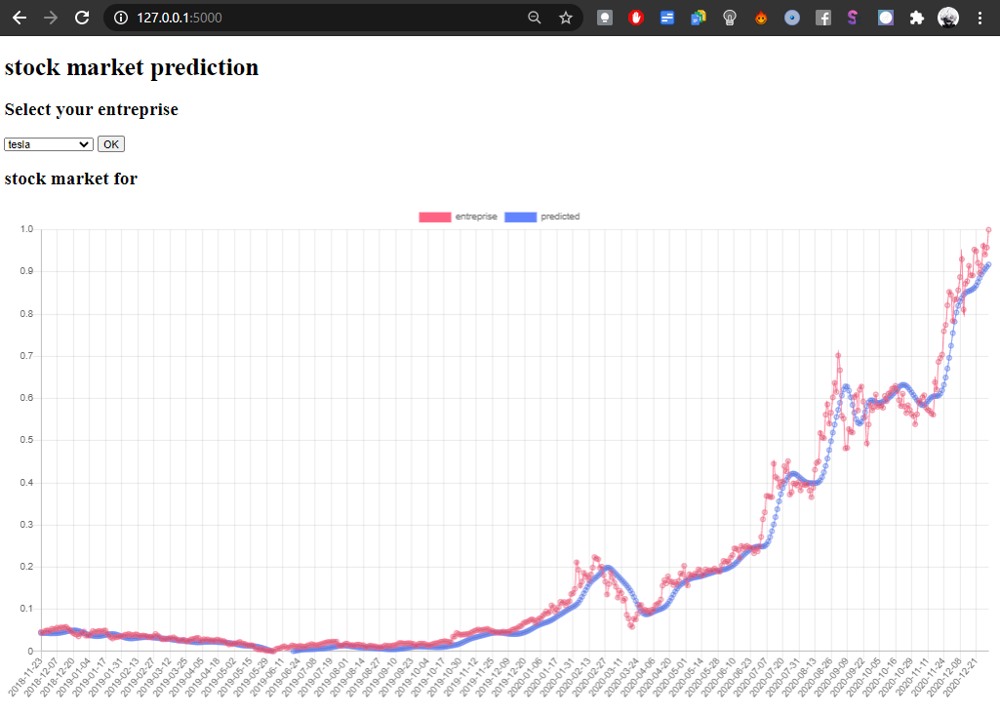

# stock-market-prediction-visualisation
predict stock market with python and  tensorflow and visualisation using flask and chartjs

<h2>disclaimer</h2>

to use the server, you must download the data from yahoo finance and  make the model.h5 for each company

to train the model and export it ,you can use the example of banckOfAmerica.py and change the dataset and names

<h2>screenshots</h2>

